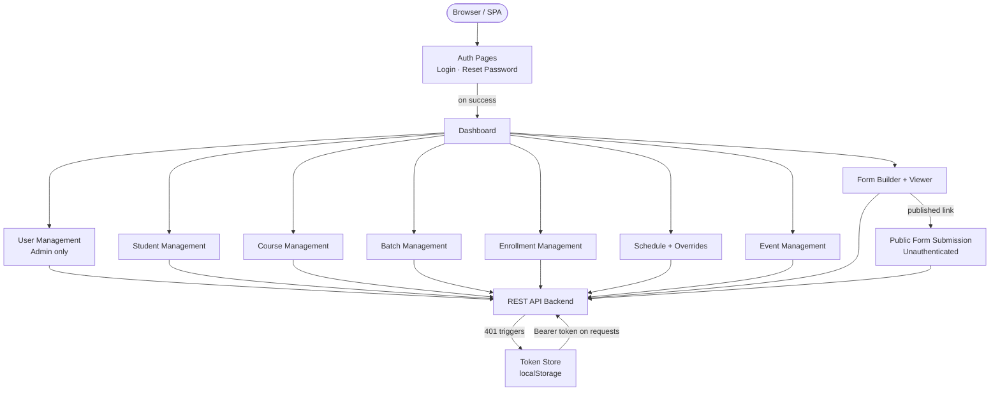
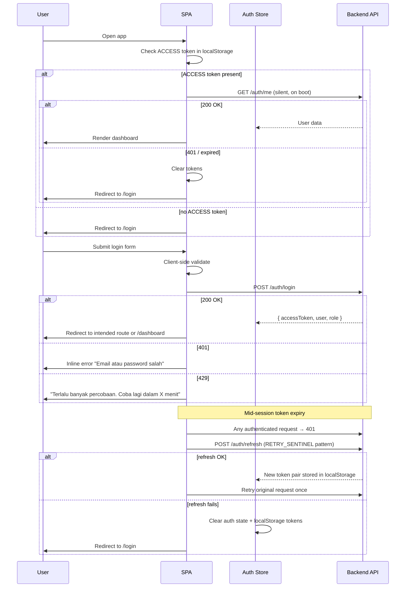
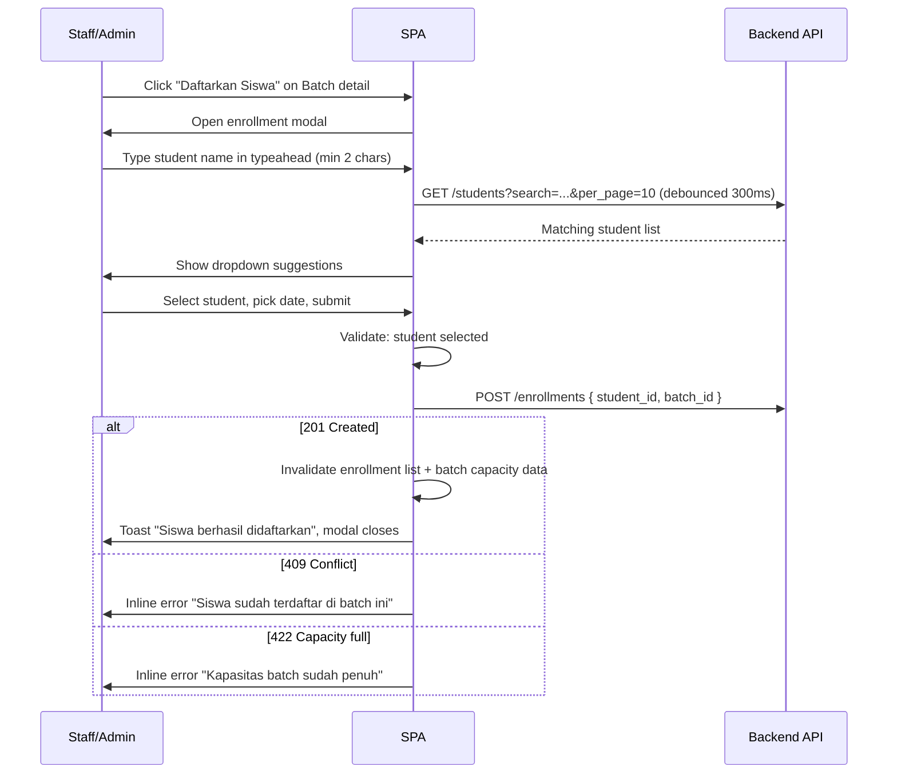
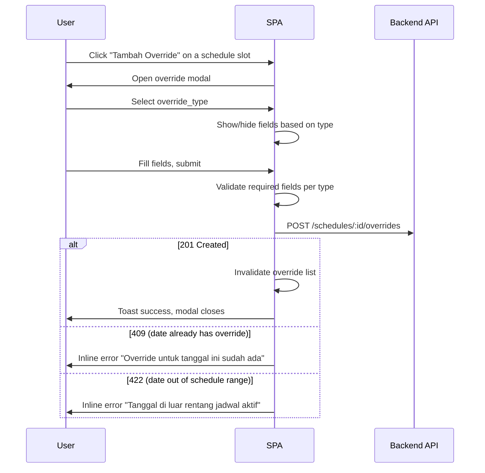
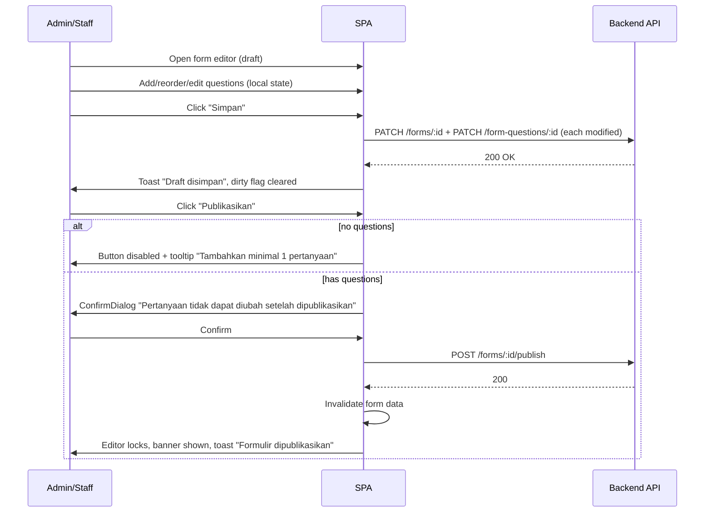
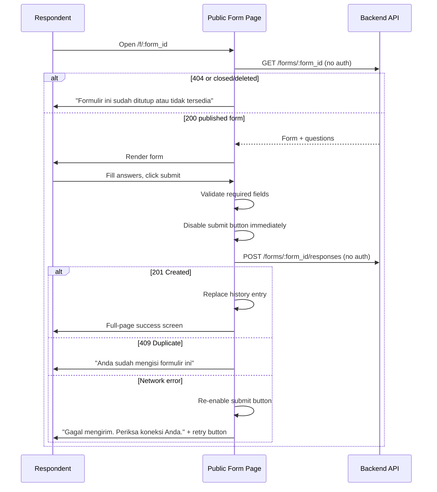

# Frontend Functional Requirement Document

## Teman Berbahasa - Tutor Place Management System

**Version:** 1.0
**Audience:** Frontend Engineers, UI/UX Engineers  
**Context:** Internal web app for tutoring center staff. Authenticated users only (admin, teacher, staff). No student-facing portal. Indonesian SME — mid-range devices, mixed connectivity.

---

## Executive Summary

A **single-page application (SPA)** serving as the internal operations dashboard for a tutoring center. Core flows: managing students, courses, batches, enrollments, schedules (with override capability), events, and a form builder with response viewer. One public-facing surface: the form submission page (unauthenticated, shareable link).

**Architecture direction:** Client-side rendered SPA. No SSR required — fully auth-gated, no SEO surface. Deployed as a static build.

**Core UX risks:**

- **Form builder complexity** — drag-reorder, question type variants, publish-lock behavior
- **Schedule override UX** — users must clearly understand session-level vs recurring-level changes
- **Role-based UI gating** — same pages, different affordances per role; must never leak write actions
- **Instructor resolution display** — UI must show the _effective_ instructor (3-level fallback: override → slot → batch default)
- **Indonesian connectivity** — graceful degradation on slow 4G; aggressive loading/skeleton states required

---

## Frontend Functional Requirement Diagram



---

## Frontend Modules

### 1. Auth

**Purpose:** Login, logout, password reset. Gate entire app behind authentication.

**UI responsibilities:**

- Login form: email + password fields
- Forgot password: request reset form (email only)
- Reset password: confirm new password form (via token from email link)
- Auto-redirect to originally intended route post-login
- Role-aware greeting on dashboard after login

**API integrations:**

- `POST /auth/login`
- `POST /auth/logout`
- `POST /auth/refresh` — called on 401 to get a new token pair
- `GET /auth/me` — called silently on app boot to restore session from stored ACCESS token
- `POST /auth/forgot-password`
- `POST /auth/reset-password`

**Auth state shape:** `{ user }` — held in global `useState`. ACCESS and REFRESH tokens stored in localStorage (via `useAuthToken`); never in component state or Pinia.

**Client-side validation:**

- Email: valid format, required
- Password: required, min 8 chars
- Validate on blur; show inline error per field

**Loading/error states:**

- Submit button: disabled + loading indicator while request in-flight
- `401` → "Email atau password salah"
- `423` / account locked → "Akun dinonaktifkan, hubungi admin"
- `429` → "Terlalu banyak percobaan. Coba lagi dalam X menit" (parse `Retry-After` header)

**Accessibility:** Autofocus email field on mount. Enter key submits. All inputs have visible labels (not just placeholders). ARIA `aria-invalid` + `aria-describedby` on error.

---

### 2. Dashboard

**Purpose:** Landing page after login. Role-aware overview.

**UI responsibilities:**

- Summary stat cards: total active students, ongoing batches, upcoming events, open forms
- Quick navigation links to each module
- Teacher view: show only batches where `instructor_user_id = current_user` + their upcoming schedule sessions

**API integrations:** Parallel requests on mount — summary counts from relevant list endpoints or a dedicated stats endpoint if provided by backend.

**Loading:** Skeleton cards while fetching. Cache results for 60 seconds.

---

### 3. User Management _(Admin only)_

**Purpose:** CRUD for system users.

**UI responsibilities:**

- Paginated table: name, email, role badge, status badge, action buttons
- Create user: modal/drawer form — name, email, role, phone, temporary password
- Edit user: same form, password field optional (blank = unchanged)
- Deactivate: confirmation dialog ("Nonaktifkan pengguna ini?") — not hard delete
- Role badge colors: `admin` = red, `teacher` = blue, `staff` = gray (consistent across app)

**API integrations:** `GET /users`, `POST /users`, `GET /users/:id`, `PATCH /users/:id`, `DELETE /users/:id`

**Permission handling:** Entire route inaccessible to non-admins. Redirect to `/dashboard` on `403`. Route not visible in sidebar for non-admins.

**Client-side validation:**

- Email: required, valid format
- Role: required
- Password: required on create, optional on edit

**Empty state:** "Belum ada pengguna. Tambah pengguna pertama." + create button.

---

### 4. Student Management

**Purpose:** Register and manage student profiles.

**UI responsibilities:**

- Paginated, searchable table: name, email, phone, status badge, registration date, actions
- Search: debounced 300ms, by name or email
- Filter bar: by `status` (active / inactive / graduated)
- Create/Edit: full-page drawer or modal — all student fields including parent info
- Student detail page: profile info + enrollment history tab
- Status badge + inline status toggle (admin/staff only)

**API integrations:** `GET /students`, `POST /students`, `GET /students/:id`, `PATCH /students/:id`

**State:** Search and filter params persisted in URL query string (deep-linkable, back-button safe).

**Client-side validation:**

- First name, last name, email: required
- Email: valid format
- Phone: numeric, Indonesian format (`08xx`), 10–13 digits
- Date of birth: date picker, must not be a future date

**Empty states:**

- No students at all: "Belum ada siswa. Daftarkan siswa pertama." + create button
- Filtered with no results: "Tidak ada siswa yang cocok dengan filter ini."

**Mobile:** Table collapses to card list on narrow viewports (<768px). Create/edit drawer becomes full-screen.

---

### 5. Course Management

**Purpose:** Manage course catalog. Admin writes; all roles read.

**UI responsibilities:**

- Table or card grid: course name, code, level badge, price, status badge, actions
- Create/Edit: modal form
- Archive: confirmation dialog; if backend blocks due to active batches, show: "Kursus ini memiliki batch aktif dan tidak dapat diarsipkan"
- Level badge: `beginner` = green, `intermediate` = yellow, `advanced` = red

**API integrations:** `GET /courses`, `POST /courses`, `GET /courses/:id`, `PATCH /courses/:id`, `PATCH /courses/:id/archive`

**Permission handling:** Create/edit/archive buttons hidden (not just disabled) for `teacher` and `staff`.

**Client-side validation:**

- Course name, course code: required
- `course_code`: alphanumeric, no spaces, auto-uppercase on input
- `price`: non-negative number
- `duration_weeks`, `max_capacity`: positive integers

---

### 6. Batch Management

**Purpose:** Manage batches scoped per course. Assign default instructor. Transition batch status.

**UI responsibilities:**

- Paginated table filterable by course, status, academic year
- Create/Edit modal:
  - Course selector — searchable dropdown
  - Instructor selector — searchable dropdown filtered to `role = teacher, status = active`
  - `batch_code` — editable, auto-suggests next sequential code per course (e.g. "B003")
  - Start/end date pickers
- Batch detail page with sub-tabs: **Info | Enrollments | Schedules**
- Status chip with explicit transition button:
  - `upcoming` → "Mulai Batch" → `ongoing`
  - `ongoing` → "Selesaikan Batch" → `completed`
  - Transition confirmation: "Batch yang sudah selesai tidak dapat dikembalikan ke status sebelumnya."
- Capacity indicator: "12 / 20 siswa" with progress bar

**API integrations:** `GET /batches`, `POST /batches`, `GET /batches/:id`, `PATCH /batches/:id`, `PATCH /batches/:id/status`

**State:** Active filters in URL params. Batch detail uses nested/tab routing with tab state in URL (`?tab=schedules`).

**Client-side validation:**

- `start_date` must be before `end_date`
- Instructor required
- `batch_code`: alphanumeric, auto-uppercase

**Empty state:** "Belum ada batch. Buat batch pertama untuk kursus ini."

---

### 7. Enrollment Management

**Purpose:** Enroll students into batches. Track payment status and final grade.

**UI responsibilities:**

- Enrollment list accessible two ways:
  1. Tab within Batch detail — students in this batch
  2. Standalone `/enrollments` page — cross-batch view, filterable by batch/student/status/payment
- Columns: student name, enrollment date, status badge, payment status badge, grade, actions
- Enroll student: modal with student typeahead search + enrollment date picker
- Update enrollment: edit modal for status/payment
- Grade field: text input, enabled only when `status = completed`
- `409` → inline error: "Siswa sudah terdaftar di batch ini"
- `422` capacity full → inline error: "Kapasitas batch sudah penuh"

**API integrations:** `GET /enrollments`, `POST /enrollments`, `GET /enrollments/:id`, `PATCH /enrollments/:id`

**Client-side validation:**

- Student: required, must be selected from typeahead (no free text)
- Payment status: required select

**Empty state (batch tab):** "Belum ada siswa yang terdaftar." + enroll button.

---

### 8. Schedule Management

**Purpose:** Define recurring sessions per batch. Log one-off session overrides.

**UI responsibilities — Schedule list (tab within Batch detail):**

- List of recurring slots: day of week, time range, room, effective instructor, recurrence type
- **Effective instructor** resolved and displayed via 3-level fallback (see utils section)
- If instructor is overridden from batch default: show visual indicator + tooltip "Instruktur berbeda dari default batch"
- Add/Edit slot modal: day picker, start/end time, room, optional instructor override (nullable), recurrence type, effective date range
- Delete slot: confirmation dialog

**UI responsibilities — Override list (per slot):**

- Expandable per slot or accessible via sub-tab
- List: original date, override type badge, summary of changes, created by, created at
- "Tambah Override" modal with fields conditional on `override_type`:
  - `reschedule` → show `new_date` (required), `new_start_time`, `new_end_time`, `new_room`, optional `new_instructor_user_id`
  - `cancellation` → `reason` only; time/room/instructor fields hidden
  - `instructor_change` → instructor selector (required) + `reason`
- Fields not relevant to selected type are **hidden entirely**, not disabled
- Inline contextual notice: _"Override ini hanya berlaku untuk sesi tanggal [X]. Jadwal rutin tidak berubah."_

**API integrations:**

- `GET /batches/:id/schedules`, `POST /batches/:id/schedules`, `PATCH /schedules/:id`, `DELETE /schedules/:id`
- `GET /schedules/:id/overrides`, `POST /schedules/:id/overrides`, `PATCH /schedule-overrides/:id`, `DELETE /schedule-overrides/:id`

**Client-side validation:**

- `start_time` before `end_time`
- `effective_from` before `effective_until`
- `override_type = reschedule` → `new_date` required
- `original_date` must fall within schedule's `effective_from` / `effective_until` (client-side hint; server authoritative)

**UX risk:** Add guidance near edit button: _"Untuk mengubah satu sesi saja, gunakan 'Tambah Override'."_

---

### 9. Event Management

**Purpose:** Manage institution-wide calendar events.

**UI responsibilities:**

- Dual view: calendar (month/week) + list; toggle persisted in local storage
- Calendar events color-coded by type: exam=red, holiday=gray, workshop=blue, meeting=purple
- Event click: detail popover or drawer
- Create/Edit: modal — title, description, event type, start/end datetime, location, audience
- Audience display: "Semua", "Siswa", "Staff", "Batch Tertentu"
- Filter bar: by event type, audience, date range
- Delete: confirmation dialog

**API integrations:** `GET /events?from=&until=` (per calendar window), `POST /events`, `GET /events/:id`, `PATCH /events/:id`, `DELETE /events/:id`

**Client-side validation:**

- Title, event type: required
- `end_datetime` after `start_datetime`

**Performance:** Fetch per calendar month window. Cache per window. Navigate to new month → fetch that window; prior months stay cached.

---

### 10. Form Management

**Purpose:** Dynamic form builder with publish lifecycle + response viewer.

**UI responsibilities — Form list:**

- Table: title, status badge, response count, created date, actions
- `deleted` forms excluded from all lists

**UI responsibilities — Form Builder (draft):**

- Metadata: title, description, allow_anonymous toggle
- Question list: drag-to-reorder (updates `order_index`)
- Add question: type picker → `text`, `multiple_choice`, `checkbox`, `rating`, `date`
- Per question: text input, `is_required` toggle, type config:
  - `multiple_choice` / `checkbox` → dynamic option list (add/remove); min 2 options
  - `rating` → min/max label inputs
  - Delete with confirmation
- Explicit "Simpan" button — no autosave
- Unsaved changes warning on navigate away

**UI responsibilities — Published state (locked):**

- Editor read-only; persistent banner: _"Formulir sudah dipublikasikan. Pertanyaan tidak dapat diubah."_
- All question inputs + drag handles + delete buttons visually disabled with lock icon

**Publish:** Button disabled + tooltip if no questions. On click: confirmation dialog → `POST /forms/:id/publish` → editor locks on success. Display copyable public URL `/f/:form_id`.

**Close/Delete:** Confirmation dialogs for both. Delete is soft (sets `deleted_at`).

**UI responsibilities — Response Viewer:**

- Total response count
- Per-question aggregates: bar/pie chart for choice questions; text list for open questions
- Individual response drill-down: respondent info + all answers
- Paginated response list
- "Ekspor CSV" → `GET /forms/:id/responses/export` → file download

**API integrations:** Full CRUD + `POST /forms/:id/publish`, `POST /forms/:id/close`, `GET /forms/:id/responses`, `GET /forms/:id/responses/export`

**State:** Form builder in local state — save explicitly. Dirty flag vs last-saved snapshot. Guard on navigate away.

---

### 11. Public Form Submission _(Unauthenticated)_

**Purpose:** Allow respondents to fill and submit a published form via shareable link.

**UI responsibilities:**

- Minimal layout — no sidebar; branded header only
- If `allow_anonymous = false`: name + email fields at top
- Questions rendered in `order_index` order with type-appropriate inputs:
  - `text` → text input / textarea
  - `multiple_choice` → radio buttons
  - `checkbox` → checkboxes
  - `rating` → star or numeric rating
  - `date` → date picker
- Required fields marked with `*`
- Sticky or bottom-anchored submit button on mobile
- Validate on submit (not on blur — reduces friction for public users)

**Post-submit states:**

- Success → full-page confirmation: "Terima kasih! Respons Anda telah diterima." (history entry replaced — back button does not re-show form)
- `409` duplicate → "Anda sudah mengisi formulir ini."
- `404`/`410` closed/deleted → "Formulir ini sudah ditutup atau tidak tersedia."
- Network error → "Gagal mengirim. Periksa koneksi Anda." + retry button (manually triggered only)

**Submit button:** Disabled immediately on first click. Re-enabled only on error.

**API integrations:** `GET /forms/:id` (no auth), `POST /forms/:id/responses` (no auth)

**Route:** `/f/:form_id` — public, no auth guard.

**Mobile-first:** This is the most likely mobile-accessed page. Full-width inputs, min 44px tap targets, adequate spacing between options.

---

## Routing & Navigation

```
/                           → redirect: authenticated → /dashboard, else → /login
/login                      → public
/forgot-password            → public
/reset-password             → public (expects ?token= query param)
/f/:form_id                 → public (form submission)

/dashboard                  → protected
/users                      → protected, admin only
/students                   → protected
/students/:id               → protected
/courses                    → protected
/courses/:id                → protected
/batches                    → protected
/batches/:id                → protected (tabs: Info | Enrollments | Schedules; ?tab= in URL)
/enrollments                → protected (standalone cross-batch view)
/events                     → protected
/forms                      → protected
/forms/:id                  → protected (builder/viewer tabs)
/forms/:id/responses        → protected
```

**Protected route behavior:**

- Unauthenticated → redirect to `/login?redirect={intended_path}`
- Post-login → redirect to `redirect` param or `/dashboard`
- Role-gated route (`/users`) → `403` → redirect to `/dashboard` + toast "Anda tidak memiliki akses ke halaman ini"

**Navigation sidebar:**

- Persistent on desktop; hamburger-toggled on mobile
- Items rendered conditionally by role — teacher sees: Dashboard, Batches, Schedules, Events only
- Active route highlighted

**Breadcrumbs:** Required on all detail/nested pages. Example: `Batches › Matematika Batch 3 › Schedules`

**Deep-linking:** All filter, search, pagination, and tab state in URL params. Pages initialize state from URL on mount.

---

## UI Components & Design System

These are **behavioral specifications** — implementation is stack-agnostic.

### Layout

- **AppShell** — sidebar + topbar + scrollable main content area
- **PublicShell** — minimal layout for `/f/:form_id` (no sidebar, branded header)
- **AuthLayout** — centered card layout for login/reset pages

### Navigation

- **Sidebar** — role-aware nav links; collapse toggle; active state indication
- **Breadcrumbs** — auto-generated from current route hierarchy
- **TabBar** — horizontal tabs synced to URL query param; used in Batch detail, Form detail

### Data Display

- **DataTable** — sortable columns, pagination controls, loading skeleton rows, empty state slot, action column
- **StatusBadge** — color-coded chip for all status ENUMs; color mapping defined once, used everywhere
- **StatCard** — icon + value + label; skeleton variant for loading
- **CalendarView** — month/week toggle; events color-coded by type; click → detail; "+N more" overflow per day
- **CapacityBar** — labeled progress bar (e.g. "12 / 20 siswa")

### Forms & Inputs

- **FormField** — wrapper: label + input + inline error message + required indicator
- **SearchInput** — text input with debounce built-in, clear button, loading indicator
- **DatePicker / DateTimePicker** — locale `id-ID`, WIB timezone display
- **TimePicker** — HH:MM
- **SelectInput** — searchable dropdown; supports async option loading
- **TypeaheadInput** — async search with debounce + min-chars; used for student search in enrollment
- **ToggleSwitch** — for boolean fields (`allow_anonymous`, `is_required`)

### Form Builder Specific

- **QuestionCard** — draggable; question text, type icon, required badge, config options; locked read-only variant
- **OptionListEditor** — dynamic add/remove inputs for choice question options
- **QuestionTypePicker** — type selection UI (dropdown or modal); shows type name + icon

### Feedback

- **Toast** — non-blocking; auto-dismiss 4–5s; position top-right desktop / top mobile; variants: success, error, warning, info
- **ConfirmDialog** — modal for all destructive/irreversible actions; consequence text; confirm button in danger color
- **AlertBanner** — inline persistent banner (form locked, stale data warning)
- **ErrorBoundary** — per-module; fallback UI with message + retry button; does not crash full app

### Loading

- **Skeleton** — block-level placeholder matching expected content shape; used on all data-fetched sections
- **ButtonSpinner** — inline loading indicator inside submit/action buttons
- **FullPageSpinner** — only for initial auth/session resolution on boot

### Reusability principles

- All write action buttons accept a visibility prop driven by role — hidden, not disabled, for unauthorized roles
- Status badge color mapping defined once globally, referenced everywhere
- ConfirmDialog reused for all destructive actions — parameterized with title, body, confirm label
- No native `window.confirm()` — always custom modal

---

## Frontend Flows

### Auth / Session Flow



---

### Enrollment Creation Flow



---

### Schedule Override Flow



---

### Form Builder → Publish Flow



---

### Public Form Submission Flow



---

## State Management Requirements

### Recommended state boundaries

| State type            | Where it lives                            | Examples                                                |
| --------------------- | ----------------------------------------- | ------------------------------------------------------- |
| Server / async data   | Server state layer (cache + invalidation) | All API data: students, batches, schedules, forms       |
| Global UI state       | Lightweight global store                  | Auth user/role/token, sidebar collapse, toast queue     |
| Local component state | Component-local                           | Modal open/close, form dirty flag, typeahead input text |
| URL state             | Query params / route params               | Filters, pagination page, search term, active tab       |

### Server state behavior

- **Stale time:** 30s for frequently-mutated lists (enrollments, overrides); 60s for reference data (courses, users)
- **Revalidation:** On window refocus for active lists; manual invalidation after all mutations
- **After mutation:** Invalidate affected queries — do not use optimistic updates for enrollment creation or batch status transitions (server validation is authoritative)
- **Exception:** Optimistic reorder acceptable in form builder question list (local state; synced on explicit save)
- **Pagination:** Preserve previous page data while fetching next — no blank flash between pages

### Auth state

- Initialized on app boot via `GET /auth/me` (requires ACCESS token in localStorage)
- Tokens (ACCESS + REFRESH) stored in localStorage via `useAuthToken`
- User object held in global `useState` — cleared on logout or unrecoverable `401`
- Idle session: after 15 min of inactivity, first user action re-validates via `GET /auth/me`; redirects to `/login` if expired

### Form builder state

- Local state holds working question list (add, remove, reorder, edit operations)
- Dirty flag: compare working state to last-saved API snapshot
- Unsaved changes guard: browser unload warning + in-app navigation guard

### Search/filter state

- All values in URL query params
- On filter change: reset pagination to page 1
- Debounce search input: 300ms

### Pagination

- Offset-based (page number) — match backend
- Default page size: 20. Page in URL (`?page=2`)
- Show previous page data while loading next

### Cross-tab behavior

- No active sync in v1
- Session invalidated in another tab → next API call returns `401` → auto-logout flow

---

## API Integration Requirements

### HTTP client behavior

- **Base config:** `baseURL`, `timeout: 10000ms`
- **Request interceptor:** Attach `Authorization: Bearer {accessToken}` to all protected requests
- **Response interceptors:**
  - `401` → attempt silent token refresh once → retry original request → if refresh fails: clear auth + redirect `/login`
  - `403` → toast "Akses ditolak" + redirect `/dashboard`
  - `422` → map field-level errors from response body to form field errors
  - `429` → parse `Retry-After` → toast with countdown "Coba lagi dalam X detik"
  - `5xx` → toast "Terjadi kesalahan pada server. Coba beberapa saat lagi."
  - Network timeout/error → toast "Periksa koneksi internet Anda"

> **Token refresh race condition:** When multiple requests fire simultaneously and all receive `401`, only one refresh call should be made. Queue all retry callbacks behind a refresh-in-progress flag. On success: replay queued requests. On failure: reject all + redirect to login.

### Per-domain specifics

| Domain                      | Notes                                                                                       |
| --------------------------- | ------------------------------------------------------------------------------------------- |
| Students (typeahead)        | `GET /students?search=&per_page=10` — debounced 300ms; min 2 chars before firing            |
| Batches (instructor select) | `GET /users?role=teacher&status=active` — loaded once, cached; not re-fetched per keystroke |
| Enrollments                 | Batch capacity sourced from batch detail response (eager-loaded) or separate count endpoint |
| Schedules                   | Effective instructor resolved client-side via shared utility — not per-component ad-hoc     |
| Form builder                | Save: PATCH form metadata + PATCH each modified question (sequential or parallel)           |
| Form responses export       | `GET /forms/:id/responses/export` → file download; check `Content-Disposition` header       |
| Public form                 | No auth header; handle `404`, `410` (closed), and `422` distinctly in UI                    |

### Retry behavior

- 1 automatic retry on network error only; never auto-retry `4xx`
- Public form submission: manual retry button only — never auto-retry (duplicate submission risk)
- Idempotent actions (`publish`, `close`): safe to retry; `200` if already in target state

---

## Validation & UX Rules

### Client-side validation rules

| Field                                   | Rule                                             |
| --------------------------------------- | ------------------------------------------------ |
| Email                                   | Valid format (RFC), required                     |
| Phone                                   | Numeric only, starts with `08`, 10–13 digits     |
| `start_date` / `start_time`             | Must be strictly before `end_date` / `end_time`  |
| `batch_code`                            | Alphanumeric, no spaces; auto-uppercase on input |
| `course_code`                           | Alphanumeric, no spaces; auto-uppercase on input |
| `price`                                 | Non-negative number                              |
| `max_capacity`, `duration_weeks`        | Positive integer                                 |
| Required question answers (public form) | Non-empty per question type; validated on submit |
| `override_type = reschedule`            | `new_date` required                              |
| Choice question `options`               | Min 2 options before form can be published       |
| Password (create)                       | Min 8 chars, required                            |
| Password (edit)                         | Optional; if provided, min 8 chars               |

### Unsaved changes

- Form builder: browser `beforeunload` warning + in-app navigation guard
- Edit modals: close confirmation if any field is dirty

### Button states

- All submit buttons: disabled + loading indicator while in-flight
- "Publikasikan": disabled + tooltip when no questions exist
- Published form editor: all inputs and actions locked (lock icon + disabled + tooltip)

### Permission-based UI visibility

- **Hide write actions entirely** for roles without permission — do not render, do not disable
- Teacher: no create/edit/delete buttons rendered anywhere
- Admin-only routes: not in sidebar for non-admins

### Duplicate submission prevention (public form)

- Submit button disabled on first click
- Re-enabled only on error response
- `409` → replace form view with already-submitted message permanently

### Input formatting

- Phone: `inputMode="tel"` for mobile numeric keyboard; no mask
- `batch_code`, `course_code`: transform to uppercase on every keystroke
- Typeahead: min 2 chars before API fires; loading indicator in dropdown while fetching

---

## Edge Cases & Failure Scenarios

| Scenario                                            | Handling                                                                                         |
| --------------------------------------------------- | ------------------------------------------------------------------------------------------------ |
| API unreachable on app boot                         | Full-page error with retry button — do not redirect to login                                     |
| Token expired mid-session                           | Silent refresh + request queue; user unaware unless refresh also fails                           |
| Form published by another user while editor is open | Server error on question save → banner: "Formulir telah dipublikasikan. Segarkan halaman."       |
| Batch status changed concurrently                   | Stale data shown; status transition returns `422` → refresh + toast "Status batch telah berubah" |
| Student typeahead returns no results                | "Tidak ada siswa ditemukan. Daftarkan siswa baru?" + link to `/students`                         |
| Override date conflict (`409`)                      | Inline modal error: "Override untuk tanggal ini sudah ada."                                      |
| Public form on slow connection (>10s)               | Skeleton → timeout fallback: "Gagal memuat formulir. Coba lagi?" + retry button                  |
| User submits public form then presses back          | History entry replaced on success — back does not re-show form                                   |
| Batch at exact capacity during enrollment           | Server `422` → invalidate + refresh capacity bar immediately                                     |
| Calendar with 50+ events in one month               | Cap per day at 5, show "+N more" overflow → popover/drawer for full list                         |
| Schedule override modal on mobile                   | Modal becomes full-screen or bottom sheet; scrollable                                            |
| Question reorder during slow save                   | Optimistic local reorder; on save error: revert to last-saved order + toast error                |
| Session invalidated in background tab               | On next API call → `401` → silent refresh attempt → if fails: redirect to login                  |
| CSV export on slow connection                       | Button shows loading state; no client timeout — browser handles file download                    |

---

## Performance Requirements

**Rendering strategy:** CSR (client-side). No SSR — fully auth-gated. Exception: `/f/:form_id` is public but SEO-irrelevant.

| Concern                    | Requirement                                                                                               |
| -------------------------- | --------------------------------------------------------------------------------------------------------- |
| Route-level code splitting | Each module/route is a separate chunk; not bundled in initial payload                                     |
| Initial JS payload         | Target <200KB gzipped for initial load (auth shell only)                                                  |
| Data fetching              | Parallel fetches on page mount; avoid sequential waterfalls                                               |
| Calendar component         | Load only on `/events` route — typically large; lazy-load per route                                       |
| Drag-drop (form builder)   | Load only on form builder route; use lightest viable solution                                             |
| Tables                     | 20 rows/page; no client virtualization needed at this scale                                               |
| Images                     | No user-uploaded images in v1; initials-based avatars (text/CSS only)                                     |
| Route prefetching          | Prefetch route chunk on sidebar link hover                                                                |
| API caching                | Stale-while-revalidate; no service worker / PWA needed in v1                                              |
| Locale                     | Single locale `id-ID`. Use native `Intl.DateTimeFormat` / `Intl.NumberFormat` — no i18n library           |
| Timezone                   | All API datetimes in UTC. Display in WIB (UTC+7): `{ timeZone: 'Asia/Jakarta' }` in `Intl.DateTimeFormat` |

---

## Frontend Architecture Recommendations

Framework-agnostic structural guidance only.

### Application type

**SPA with client-side routing.** Single HTML entry point. All routing in the browser.

### Folder structure (pattern)

```
src/
├── api/              # HTTP client instance + per-domain request functions
├── components/       # Shared/generic UI components
│   ├── base/         # Primitives: Button, Input, Modal, Badge, Table, etc.
│   └── shared/       # App-level: DataTable, StatusBadge, ConfirmDialog, Toast
├── features/         # Feature modules — colocated pages, components, local logic
│   ├── auth/
│   ├── students/
│   ├── batches/
│   ├── schedules/
│   ├── enrollments/
│   ├── forms/
│   │   ├── builder/
│   │   └── public/
│   └── events/
├── store/            # Global state (auth, UI preferences)
├── hooks/            # Shared hooks: useDebounce, useUnsavedChanges, etc.
├── utils/            # Pure helpers: date formatting WIB, instructor resolution, etc.
├── types/            # Shared types / API response shapes
└── router/           # Route definitions with lazy-loaded feature modules
```

### Architectural rules

- **Feature-colocated** — each feature owns its own pages, sub-components, local hooks
- **Shared components are behavior-only** — no feature-specific logic in shared components
- **Instructor resolution** is a pure utility function in `utils/` — not ad-hoc per component
- **Role-based rendering** via a single `getCurrentUser()` / role accessor — not inline string comparisons scattered across components
- **No prop drilling past 2 levels** — lift to server state or global store
- **All forms controlled** — no uncontrolled inputs

### Data fetching

- Centralized server state management with caching and invalidation
- All API calls through `api/` layer — no direct fetch in components or pages
- Mutations always invalidate relevant queries on success

### Form handling

- All forms fully controlled and validated client-side before API call
- Validation schema defined separately from UI (reusable, testable)
- Form builder uses local reducer pattern (add / remove / reorder / update actions)

### Token refresh on 401 (critical)

`useApi` uses a RETRY_SENTINEL symbol pattern:

1. `onResponseError` catches `401` → calls `refresh()`, throws `RETRY_SENTINEL`
2. Outer wrapper catches `RETRY_SENTINEL` → retries the original request once with the new token
3. If refresh fails → tokens cleared, caller receives the original error

This is simpler than a shared-Promise queue because `$fetch.create` serializes retries naturally. Concurrent 401s each trigger refresh independently; duplicate refreshes are idempotent if the backend accepts a valid REFRESH token.

---

## Open Questions

| #   | Question                                                                             | Impact                                                             |
| --- | ------------------------------------------------------------------------------------ | ------------------------------------------------------------------ |
| 1   | Should teachers view enrollment lists for their own batches only, or all batches?    | Affects teacher-role filtering throughout enrollment module        |
| 2   | Is CSV export for form responses sufficient, or is Excel (.xlsx) required?           | Export implementation complexity                                   |
| 3   | Is there a notification (email/WhatsApp) for schedule overrides? Who gets notified?  | Whether notification config UI is needed                           |
| 4   | Is `/f/:form_id` publicly accessible on the internet, or internal network only?      | CORS configuration + whether sharing across networks is intended   |
| 5   | Should the public form page carry branding (logo, colors)?                           | Design scope of public page                                        |
| 6   | Bahasa Indonesia only, or English also required?                                     | Whether any i18n infrastructure is needed                          |
| 7   | When batch default instructor is reassigned, do existing overrides remain unchanged? | Whether a UI warning is needed on instructor reassignment          |
| 8   | Is a student-facing portal planned for future phases?                                | Affects routing namespace decisions now                            |
| 9   | Should form response count update in real time, or refresh-on-demand only?           | Polling vs SSE vs manual refresh                                   |
| 10  | Is mobile a primary use case for staff, or desktop-primary?                          | Responsive priority for complex pages: form builder, schedule grid |
| 11  | Can teachers create schedule overrides themselves, or is that admin/staff only?      | One open row in permission table                                   |
| 12  | Is there a maximum number of questions per form?                                     | Whether a client-side guard on "add question" is needed            |
